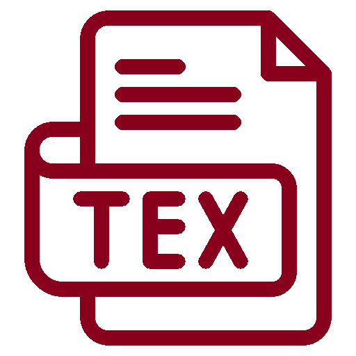

<div id="top"></div>

<br />

<!-- PROJECT SHIELDS -->
<!--
*** I'm using markdown "reference style" links for readability.
*** Reference links are enclosed in brackets [ ] instead of parentheses ( ).
*** See the bottom of this document for the declaration of the reference variables
*** for contributors-url, forks-url, etc. This is an optional, concise syntax you may use.
*** https://www.markdownguide.org/basic-syntax/#reference-style-links
-->
[![Contributors][contributors-shield]][contributors-url]
[![Forks][forks-shield]][forks-url]
[![Stargazers][stars-shield]][stars-url]
[![Issues][issues-shield]][issues-url]
[![MIT License][license-shield]][license-url]
[![Researchgate][researchgate-shield]][researchgate-url]


<!-- PROJECT LOGO -->
<br />
<div align="center">
  <figure>
    <a href="https://github.com/Bojan-Lukic/latex-dissertation-and-conference-templates">
      
    </a><br />
    <figcaption><sub>Icon made by <a href="https://www.flaticon.com/authors/iconmarketpk">IconMarketPK</a> from www.flaticon.com.</sub></figcaption>
  </figure>

<h3 align="center">LaTeX templates for dissertations and conference papers</h3>

  <p align="center">
    Fully functional LaTeX templates for creating dissertations and papers, examples and samples included.
    <br />
    <a href="https://github.com/Bojan-Lukic/latex-dissertation-and-conference-templates/tree/main/doc"><strong>Explore the docs »</strong></a>
    <br />
    <br />
    <a href="https://github.com/Bojan-Lukic/latex-dissertation-and-conference-templates/tree/main/src">View Demo</a>
    ·
    <a href="https://github.com/Bojan-Lukic/latex-dissertation-and-conference-templates/issues">Report Bug</a>
    ·
    <a href="https://github.com/Bojan-Lukic/latex-dissertation-and-conference-templates/issues">Request Feature</a>
  </p>
</div>

<br />


<!-- TABLE OF CONTENTS -->
<details>
  <summary>Table of Contents</summary>
  <ol>
    <li>
      <a href="#about-the-project">About The Project</a>
      <ul>
        <li><a href="#built-with">Built With</a></li>
      </ul>
    </li>
    <!-- <li>
      <a href="#getting-started">Getting Started</a>
      <ul>
        <li><a href="#prerequisites">Prerequisites</a></li>
        <li><a href="#installation">Installation</a></li>
      </ul>
    </li> -->
    <li><a href="#usage">Usage</a></li>
    <!-- <li><a href="#roadmap">Roadmap</a></li> -->
    <li><a href="#contributing">Contributing</a></li>
    <li><a href="#license">License</a></li>
    <li><a href="#contact">Contact</a></li>
    <li><a href="#acknowledgments">Acknowledgments</a></li>
  </ol>
</details>

<br />


<!-- ABOUT THE PROJECT -->
## About The Project

LaTeX templates for generic dissertations as well as conference papers. The template for the dissertation is a modification of the template from [here](https://www.ite.tu-clausthal.de/studium/abschlussarbeiten/vorlagen). The conference template is in the style of IEEE, just more generic. 

<br />


### Built With

* [LaTeX](https://www.latex-project.org/)
* [MiKTeX](https://miktex.org/)
* [TeXstudio](https://www.texstudio.org)

<br />


<!-- GETTING STARTED -->
<!--
## Getting Started

This is an example of how you may give instructions on setting up your project locally.
To get a local copy up and running follow these simple example steps.

### Prerequisites

This is an example of how to list things you need to use the software and how to install them.
* npm
  ```sh
  npm install npm@latest -g
  ```

### Installation

1. Get a free API Key at [https://example.com](https://example.com)
2. Clone the repo
   ```sh
   git clone https://github.com/github_username/repo_name.git
   ```
3. Install NPM packages
   ```sh
   npm install
   ```
4. Enter your API in `config.js`
   ```js
   const API_KEY = 'ENTER YOUR API';
   ```

<br />
-->


<!-- ROADMAP -->
<!--
## Roadmap

- [] Feature 1
- [] Feature 2
- [] Feature 3
    - [] Nested Feature

See the [open issues](https://github.com/github_username/repo_name/issues) for a full list of proposed features (and known issues).

<br />
-->


<!-- CONTRIBUTING -->
## Contributing

Contributions are what make the open source community such an amazing place to learn, inspire, and create. Any contributions you make are **greatly appreciated**.

If you have a suggestion that would make this better, please fork the repo and create a pull request. You can also simply open an issue with the tag "enhancement".
Don't forget to give the project a star! Thanks again!

1. Fork the Project
2. Create your Feature Branch (`git checkout -b feature/AmazingFeature`)
3. Commit your Changes (`git commit -m 'Add some AmazingFeature'`)
4. Push to the Branch (`git push origin feature/AmazingFeature`)
5. Open a Pull Request

<br />


<!-- LICENSE -->
## License

Distributed under the MIT License. See `LICENSE.txt` for more information.

<br />


<!-- CONTACT -->
## Contact

Bojan Lukic - [Website](https://www.bojanlukic.com/)

Project Link: [https://github.com/Bojan-Lukic/latex-dissertation-and-conference-templates](https://github.com/Bojan-Lukic/latex-dissertation-and-conference-templates)

<br />


<!-- ACKNOWLEDGMENTS -->
## Acknowledgments

* All rights reserved to [Stefanie Säfken](https://www.ite.tu-clausthal.de/ueber-uns/team/stefanie-saefken) who created the fundamental dissertation template and uploaded it to the [website](https://www.ite.tu-clausthal.de/studium/abschlussarbeiten/vorlagen) of the Institute of Subsurface Energy Systems 

<p align="right">(<a href="#top">back to top</a>)</p>


<!-- MARKDOWN LINKS & IMAGES -->
<!-- https://www.markdownguide.org/basic-syntax/#reference-style-links -->
[contributors-shield]: https://img.shields.io/github/contributors/Bojan-Lukic/latex-dissertation-and-conference-templates.svg?style=for-the-badge
[contributors-url]: https://github.com/Bojan-Lukic/latex-dissertation-and-conference-templates/graphs/contributors
[forks-shield]: https://img.shields.io/github/forks/Bojan-Lukic/latex-dissertation-and-conference-templates.svg?style=for-the-badge
[forks-url]: https://github.com/Bojan-Lukic/latex-dissertation-and-conference-templates/network/members
[stars-shield]: https://img.shields.io/github/stars/Bojan-Lukic/latex-dissertation-and-conference-templates.svg?style=for-the-badge
[stars-url]: https://github.com/Bojan-Lukic/latex-dissertation-and-conference-templates/stargazers
[issues-shield]: https://img.shields.io/github/issues/Bojan-Lukic/latex-dissertation-and-conference-templates.svg?style=for-the-badge
[issues-url]: https://github.com/Bojan-Lukic/latex-dissertation-and-conference-templates/issues
[license-shield]: https://img.shields.io/github/license/Bojan-Lukic/latex-dissertation-and-conference-templates.svg?style=for-the-badge
[license-url]: https://github.com/Bojan-Lukic/latex-dissertation-and-conference-templates/blob/master/LICENSE.txt
[researchgate-shield]: https://img.shields.io/badge/-ReearchGate-grey?style=for-the-badge&logo=researchgate
[researchgate-url]: https://www.researchgate.net/profile/Bojan_Lukic2
[product-screenshot]: images/screenshot.png
